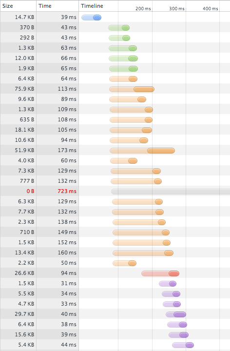
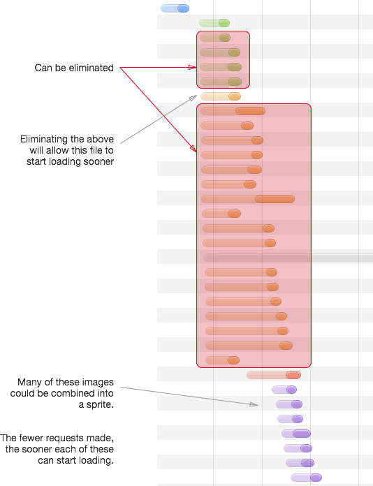

# Page Lifecycle and Performance

It's rarely the case that a website is inherently slow. Unless a synchronous operation blocks for a fixed amount of time (i.e.: a `while` loop that iterates until a certain number of milliseconds have passed), it's possible for any computer to render any given page in a very small amount of time, given infinite resources (network throughput, CPU, GPU, etc.).

Computers with infinite resources do not exist, though. The constraints of the of the visitors' devices to any particular site are usually the limiting factors in a page's load time.

Consider the following waterfall diagram, produced by the Chrome Developer Tools (for a site which shall remain nameless):

In this example, you'll notice that there are many connections to the server, and many of those connections are for resources which could have been combined. The page loads on my cable internet connection in three seconds.

All in all, performing some simple optimizations could have saved this site nearly two seconds of load time, bringing the time until the page is interactive from one and a half seconds to under half a second.

These topics will be discussed in greater detail in the next few chapters, but the high-level goals are to do the following:

- Decrease the impact of latency by minimizing the amount of back-and-forth communication between the client and the server.
- Decrease the amount of work that needs to be done in order to deliver and render the page.
- Optimize the amount of information sent over a single connection in order to take advantage of the user's bandwidth.
- Increase the number of operations the browser can perform concurrently while avoiding the cost of creating additional connections.
