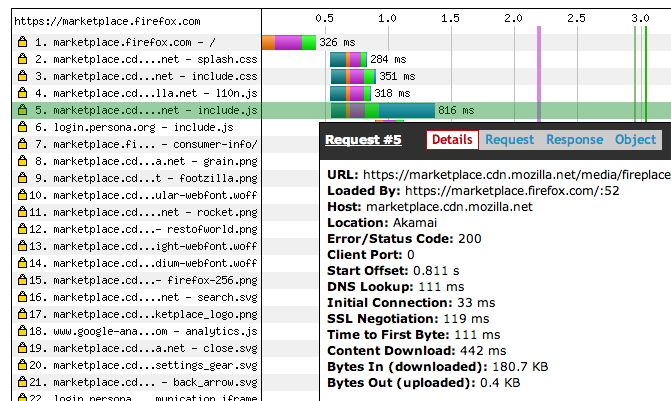
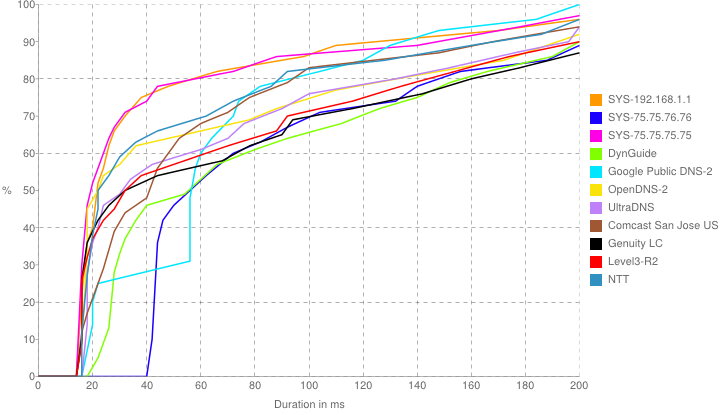

# DNS Lookups


Most engineers don't consider DNS lookups when they are optimizing their page's load time for a few reasons:

1. During development, you probably aren't connecting to a remote server.
2. If you are connecting to a remote server, your browser or operating system probably has the DNS lookup cached.
3. Most developers are on relatively low-latency connections and DNS lookups are fast.
4. There isn't much you can do to speed the DNS lookup up.

To demonstrate the performance impact of a DNS lookup, consider the following waterfall diagram of a website:



You can see in this diagram that it took 111ms before the browser could even begin to connect to the CDN and perform an SSL handshake. If your goal is to make a page load in under one second, 100ms is not something you have to spare.

DNS lookups should be considered slow by default, and they play a very large role in decreasing the performance of websites. To illustrate, here's a graph generated by the open source application namebench:



This benchmark was run from my apartment in Mountain View, California over wifi. My ISP is Comcast, and the results support that: the two lines furthest to the left are Comcast's DNS server (75.75.75.75) and my wireless router (which uses Comcast's DNS)[^google_dns_throttle]. Curiously, Comcast's alternate DNS server (75.75.75.76) is among the slowest, taking a minimum of 40ms for its fastest response.

[^google_dns_throttle]: It should be noted that the results for Google's DNS servers shift sharply to the right, indicating that their servers may have throttled connections from my IP address during the test, resulting in unusually high lookup times.

My internet connection is average, or perhaps slightly above average compared to the rest of the continental US. Based on this benchmark, however, you can see that DNS lookups took--regardless of the DNS server--a minimum of about 15ms for the absolute fastest responses. The 80th percentile (one out of every five), though, took longer than 60ms. At the 90th percentile, lookup times nearly triple to well over 150ms.


## Remedying slow DNS lookups

There's very little you can do to make DNS lookups faster, but you can do a number of things to decrease their impact.

The first solution is to use a single domain name. If you don't need separate subdomains, don't use them. The more domains in your application, the more DNS lookups that will need to be performed, and removing all but one ensures that your page load time is not impacted more than once.

Unfortunately, using a single domain is rarely an option for many websites. To use CDNs or take advantage of domain sharding (both discussed later), it's often necessary to have--at minimum--a second subdomain.

In this case, the second best option is to give the browser a hint about where your content is hosted before you request it. This is very easy: simply drop the following `<link>` tag on your page for each domain your site accesses:

```html
<link rel="dns-prefetch" href="//your.other.domain.com">
```

The browser will use that information to immediately start a DNS lookup of the hostname specified. If a request is made where the hostname matches the domain in the `href=""`, the corresponding address will already be cached.

This even works if you send HTML to the browser incrementally (e.g.: using PHP's `flush()` function). The browser will kick off the DNS lookup immediately, and resources sent to the browser later as part of the same page will use the cached response.

Lastly, if you are taking advantage of domain sharding, it's likely that you're imposing a very large number of DNS lookups on the client. For instance, a site using domain sharding might make the following requests:

```
www.mysite.com
static1.mysite.com
static2.mysite.com
static3.mysite.com
```

At more than 100ms each, the volume of DNS lookups can quickly dominate a large part of your page's lifecycle. You can mitigate this issue by implementing HTTP2 or SPDY on your server. While domain sharding is used to circumvent caps specified by the browser to limit the number of connections to any one host, these two protocols can be used to combine an unlimited number of concurrent requests into a single connection. This means that users with modern browsers accessing sites that support HTTP2 or SPDY will only perform a single DNS lookup.
