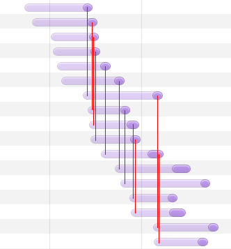

# Server Connections

Like DNS, the actual TCP connections involved in each request are an often-overlooked component in web performance and a piece which has few remedies. TCP connections are inherently expensive: connecting and disconnecting each involve one and a half round trips. Most browsers limit the number of connections that can be made to any given host. There are a number of signals that you can look for, though, that can indicate a potential performance bottleneck.

## Too many connections

Until recently, browsers limited the number of HTTP connections to any single host to 2. Most modern browsers have increased that limit to at least 6[^1]. This number is fine for small pages with a small number of assets, but it can be disastrous for content-heavy pages that make dozens of requests.

The image above is a screenshot from the Chrome developer tools showing a series of requests for images. I've drawn in red lines to show that the end of one request triggers the start of another. Also notice that no more than six requests are triggered concurrently at any given time. That is, you can draw a vertical line at any point on the chart and cross at most six active connections[^2].

The first way to remedy this is to make sure that if you can, HTTP2 and/or SPDY are implemented on the server. Both allow an unlimited number of concurrent requests to be performed, and the server can decide how it wants to respond to them depending on load.

The second solution to this is to simply decrease the number of requests. Even with unlimited concurrent requests, larger numbers of requests result in more work that the client must perform. Additionally, files do not compress together. This means that redundant data across files is not simply hand-waved away as you would expect with redundant data in a single file. If multiple files can be combined with no impact on the user, that is a worthwhile change to make. Later chapters discuss in more detail how to effectively combine assets.

Lastly, you can use a technique known as domain sharding to avoid the connection limit for browsers that do not support HTTP2 or SPDY. Domain sharding (as described previously with regard to DNS lookups) involves creating several DNS records for one or more hosts containing your assets. For instance, `static1.example.com`, `static2.example.com`, etc. might all point at the same IP address which hosts a site's JavaScript, CSS, and images. In the page, the URLs for each asset reference each of these hosts in a round-robin manner. In doing this, the browser recognizes each hostname as an independent server and applies the connection cap to each hostname. If you use `static1` through `static4` for instance, you could expect to make up to 24 simultaneous connections.

As mentioned previously, domain sharding comes at a cost: DNS lookups. Despite each hostname pointing at the same IP address, the browser does not know that until after it has performed a DNS lookup. This can become quite costly, and in some cases cause significant performance degradation. You should only use domain sharding if HTTP2 and SPDY are not an option.

Historically, a `Connection: Keep-Alive` header could be echoed to any client that sent the same header as part of a HTTP request. This allowed the client to re-use connections. HTTP 1.1 made this the default behavior for HTTP connections, however, and sending the header is unnecessary for all mainstream browsers.

[^1]: Internet Explorer 10 and up and Opera 10 have a limit of eight concurrent connections rather than six.
[^2]: The rounded edges of the graph may make it look like seven active connections are taking place near the start and end of each request, but that is entirely aesthetic.

## High latency

For users on high-latency connections, creating many TCP connections may be impractical. Other users may have artificially restrictive limits on TCP connections (such as users communicating through an HTTP proxy). In this case, the best solution is to decrease the amount of time it takes to establish a connection.

To do this, collect some data. Measure the amount of time it takes to establish a connection to the web server from a point very near to the server (i.e.: from another server in the same data center). If that number is high, you should investigate the stack that you're using on the server. If you don't have a load balancer, or are using a single-threaded server, installing a reverse proxy like Nginx may solve much of the problem.

For users that are located internationally, long connection times are likely a result of distance. A CDN (discussed in a later section) allows you to serve content from a server that is physically closer to the user (a "point of presence", or "PoP"). This can lead to lower overall latency.
