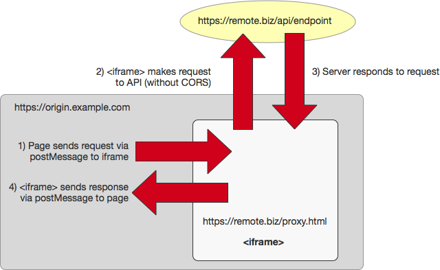

# CORS

Some sites take advantage of a technology known as CORS to make cross-domain requests. For instance, a page on `x.example.com` might want to make an AJAX request to `y.example.com`. Normally, this is not allowed and the `XMLHttpRequest` object would fire an `error` event. CORS allows the remote hostname to specify a set of HTTP headers that instruct the browser to allow the request to take place.

The downside to CORS is that for any non-idempotent request (i.e.: any HTTP method other than HEAD, GET, or OPTIONS), the browser makes a second request known as a "CORS pre-flight". The pre-flight request is an OPTIONS request to the URL that was requested. The browser expects to receive a response containing headers that look like this:

```raw
Access-Control-Allow-Methods: GET,POST,OPTIONS
Access-Control-Allow-Origin: x.example.com
```

When the browser sees this response, it knows that it is allowed to perform the request and submits the what the `XMLHttpRequest` object would otherwise have submitted had it not been pointed at a remote domain.

This pre-flight procedure blocks the "actual" HTTP request from taking place, meaning that for every one AJAX request made, two network requests are made. On high-latency connections, this can cause a significant amount of sluggishness for sensitive network requests.

There are a number of solutions: the first is to simply not make the request from a remote domain. If possible, put the endpoint that you are accessing on the same hostname. This cannot always be done, such as when the remote hostname is managed by a third party.

The second solution is to use an iframe proxy. In this approach, requests are routed through an iframe using `postMessage` (checking origins, of course) so that the HTTP request is made from the destination origin. This, of course, requires that the remote host can host such an HTML file and that it does not specify an `X-Frame-Options` header that blocks framing.



A third approach is to use the the `Access-Control-Max-Age` header, which specifies how long the browser should cache the result of the pre-flight request for. The header should look something like this:

```raw
Access-Control-Max-Age: 86400
```

Unfortunately, `Access-Control-Max-Age` is not supported in Firefox at the time of writing, and support in Chrome seems to set a maximum value of 600 (ten minutes)[^1]. Internet Explorer support is unknown.

[^1]: http://crbug.com/131368

A fourth option is to use JSONP. This involves injecting a `<script>` tag into the page, which--when loaded--makes a function call to a callback method to pass results. This approach works well, though JSONP is not always available. Additionally, making JSONP requests to a third party introduces security issues.

If a pre-flight request must take place, HTTP2 can be implemented on the remote host to help minimize the overhead of creating a separate connection for the pre-flight.
