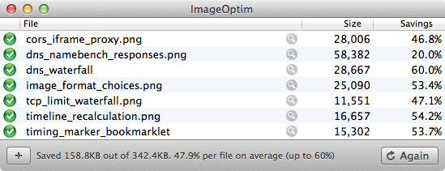

# Compress Images

Compressing your images can provide an astounding amount of performance benefit. Images with fairly small dimensions can even outweigh even some large JavaScript files. In addition, most image editing applications include a significant amount of metadata in the images that get produced. This includes information about the software, legal information, comments, description, title, etc. In the context of the web, none of this information is useful to a browser and wastes takes up valuable bytes.

Most image editing software uses encoding algorithms that are sub-par. Inefficiencies in the algorithms mean that bytes are needlessly wasted as image data is written in a more verbose way than necessary. This is not to say that the images will decrease in quality when re-encoded: the images should be losslessly re-written to a smaller file representation.

First, ensure you're using the right image encoding for each of your images. A guide for doing this is available in the Images section of the Assets and Payload chapter.


## OS X

If you're using OS X as your operating system, I highly recommend using [ImageOptim](http://imageoptim.com/). This tool supports most major image formats and does a great job of minimizing your assets' sizes.



After installing, simply drag and drop your images into ImageOptim. They will automatically be losslessly compressed and saved for you. Most popular image types are supported.


## Other *NIX Operating Systems

If you're using any other Linux or other *NIX operating system, you can use a number of tools to perform compression. The first tool is pngcrush. You can install it from all popular package managers.

```bash
# -ow overwrites the original file
pngcrush -ow static/img/my_png.png
```

JPEG images have a similar corresponding tool known as jpegoptim. It's used in a very similar way:

```bash
jpegoptim static/img/my_jpeg.jpg
```

Lastly, GIF files can be optimized with another such tool: gifsicle.

```bash
# gifsicle requires an output parameter, but it can be the same path
gifsicle static/img/my_gif.gif -O3 -o static/img/my_gif.gif
```

## CDNs

Some CDNs like CloudFlare[^1] have features that compress your images for you. These features generally have two options: lossless and lossy. Lossless compression has no quality difference--the tools only remove unnecessary information from the image files, like with pngcrush. Lossy image compression generally applies to JPEG files and attempts to remove extra information in a way that *does* decrease the quality of the image, but in a way that is not noticeable.

[^1]: CloudFlare's product is known as Polish. https://blog.cloudflare.com/introducing-polish-automatic-image-optimizati/
